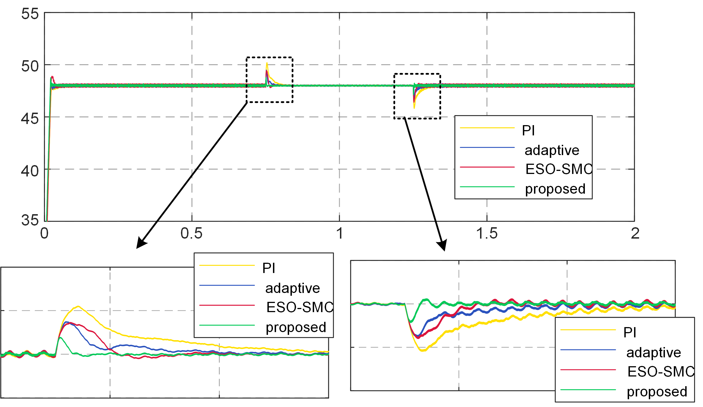
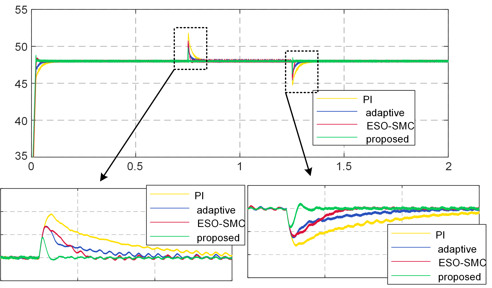
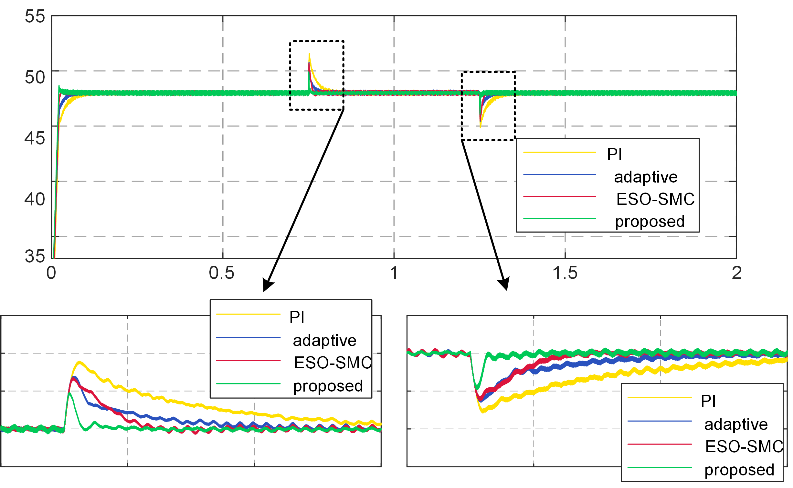

# Full State Linear Reconstruction of SPMSG Systems
This repository contains simulations and code for an improved linear controller based on full state reconstruction, including conmparisons with a PI-based controller and an ESO-ITSMVC controller.
The implementation is available in MATLAB (R2020b for simulink and R2019b for the code).
## Features
Simulations: Users can adjust various parameters to simulate different operation conditions.  
Code: Code for this experiment validation is written in MATLAB and translatable to C through MATLAB code generation.
## Simulation results
MATLAB simulation results of the DC voltage dynamic response under load steps are shown blow, comparing four controllers: the proposed full state linear reconstruction-based controller, PI-based controller, adaptive controller, and ESO-ITSMVC controller.
### Condition 1

load changes from 45Ω to 500Ω and back to 45Ω at 800r/min
### Condition 2

load changes from 40Ω to 15Ω and back to 40Ω at 800r/min
### Condition 3

load changes from 10Ω to 20Ω and back to 10Ω at 1200r/min

## Contact
For any queries or further discussion regarding the project, please open an issue in this repository or direct connect kaipeng@hust.edu.cn.
